# Face-Mask-classification [](https://www.python.org/downloads/release/python-370/)
- Tech/Fameworks used: OpenCV, Keras/TensorFlow, OpenCV and Deep Learning (look at the requirements.txt file)

### Model that recognizes whether a person young or old wears a mask on his/hers face  
- The goal of our project was to create a robust classifier with four defined classes, to collect data and prepare a custom dataset;
- After designing a well-balanced dataset that will allow no bias in the classification task, we have built a model that recognizes whether a person wears a mask on his/hers face or not;
- Furthermore, the model recognizes as well whether the person is young or old;

### :innocent: Motivation
Wearing a mask is considered to be an important tool in slowing and preventing the spread of COVID-19, especially if used universally within communities. There is increasing evidence that masks/cloth coverings help prevent people who have COVID-19 from spreading the virus to others. The advice and recomendations from international authorites and many governments vary from voluntaritly to compulsory wearing them in public places. This means that the prolonged pandemic imposes new way of everyday life and learning new habbits. Monitoring compliance at public places is an expensive operation. Thus, we believe that by providing this code as resource that can be further deployed for real-time masked-face recognition in a surveillance system will help in tracking the behavior of mask-wearing in public places, such as shopping malls, supermarkets, institutions, etc.

We strongly believe that every individual should strive to contribute in his/hers own capacity in order to suppress the spread of Covid-19 and help in putting an end to the pandemic.

Well, this is our way of contribution :smile:

### Demo (Screenshot from live video)
__________________________________________________________________________
| Mask Young prediction       |  No Mask Young prediction   |
:----------------------------:|:----------------------------:
  |  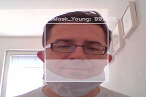 
| Mask Old prediction       |  No Mask Old prediction   |
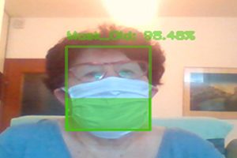  |  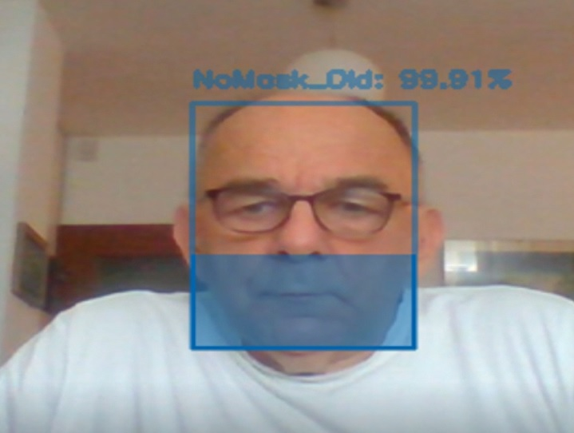 

## The project implementation was divided in 3 Phases:
## :open_file_folder: Phase 1 : Dataset creation (dataset avaliable upon request)
- General Project Research

In order to train a deep-learning model to classify whether a person is wearing a mask or not and whether he/she is young or old, we needed an appropriate dataset with balanced distribution of images for the four classes:
* wearing a mask_old
* wearing a mask_young
* not wearing a mask_old
* not wearing a mask_young

One of the challenges we met doing this project was collecting the data. We decided to collect images that we were supposed to take without using ready-made data and datasets that were created for facial recognition purposes. We have done that, so our database contains 80% of the real images that we as a team took. Artificial masks were not applied, so this is a real and authentic dataset and we are very proud of the team effort.
_________________________________________________________________________________
- Dataset Collection  
This dataset consists of **2,944 images** belonging to four classes in four folders:

| dataset         | Young       | Old          | Total     |      
| -------------   | ------------| -------------|-----------|
| **with_mask**       | 775         | 689      | 1,464     |
| **without_mask**    | 756         | 724      | 1,480     |   
| **Total**           |1,531        |1,409     | **2,944** |

The images used were real images of faces wearing masks and faces without masks.

### Preview of dataset

| Class     | #1| #2          | #3     | #4| #5 |  
| -------------   | ------------| -------------|-----------|-----------|-------------|
|Mask Young   |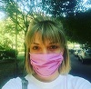|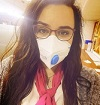|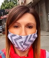||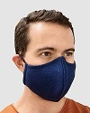|
|NoMask Young ||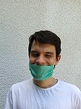||||
|Mask Old     |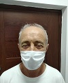|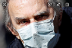|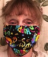|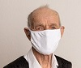||
|NoMask Old   ||||||
_____________________________________________________________________________________
- Dataset Preparation  

We have expanded the size of a training dataset by creating modified versions of images in the dataset. 
The dataset was divided on **train 80% /test 10% /valid 10%** folders with python code   
with use of split-folder library  
```
import split_folders
split_folders.ratio('data_final', output="output", seed=1337, ratio=(.8, .1, .1))
```
Classes ratio by folders:
|Dataset  |mask_old     |nomask_old  |mask_young     |nomask_young   |Total     |%     |
|-----    | -----       | -----      |  -----        |  -----        | -----    |----- |
|Train	  |551	        |579	     |620	     |604	     |2,354	|**80%**   |
|Valid	  |68	        |72	     |77	     |75	     |292	|**10%**   |
|Test	  |70	        |73	     |78	     |77	     |298	|**10%**   |
|Total	  |689	        |724	     |775	     |756	     |2,944	|     |
|%	  |23%	        |25%	     |26%	     |26%	     |	       |    |


## :muscle: Phase 2 : Training the model
- Research about neural networks  

To solve this problem, we needed to try several image classifiers that classify one of four categories. To construct this classifier, we used pre-trained CNN.
The best results are as follows:

| Model         | Epochs        | Test Accuracy|      
| ------------- | ------------- | -------------|
| MobileNetV2   | 50            | 91.00%
| **Xception - Used Data Augumentation**     | **100**           | **95.97%**
| DenseNet-169  | 100           | 96.98%      | 
__________________________________________________________________________________________________
### :bulb: Compose neural network architectures  
Best overall results were achieved with transfer-learning using pre-trained **Xception** an re-train it on our data in ImageNet  - 100 epoch; *Accuracy 95,97%*  (download avaliable upon request) 

The experimental results show that *transfer-learning* can achieve very good results in a small dataset, and the final accuracy of face mask detection is 95,97%.
Another and also important reason for choosing this model, was the fact that this model showed the best results at the very relevant metrics, recall, and precision and good results on real video stream.

#### :key: Results

| Class         | precision     | recall       | f1-score    |     
| ------------- | ------------- | -------------|------------ |
| Mask_Old      | 0.94          | 0.99         |   0.96      |
| Mask_Young    | 0.95          | 0.95         |   0.95      |
| NoMask_Old    | 0.97          | 0.96         |   0.97      |
| NoMask_Young  | 0.97          | 0.95         |   0.96      |
| micro avg     | 0.96          | 0.96         |   0.96      |
| macro avg     | 0.96          | 0.96         |   0.96      |
| weighted avg  | 0.96          | 0.96         |   0.96      |
| samples avg   | 0.96          | 0.96         |   0.96      |
 
___________________________________________________________________________________________________

## :rocket: Phase 3 : Detection in real-time video streams

We use our model in real-time video streams as FaceMask detector 
| Mask/NoMask Young       |  Mask/NoMask Old   |
:-------------------------:|:-------------------------:
  |  

 
- Use "FaceMask_detect_video.py", copy trained model in root folder and run the code.


### :clap: Authors
This project was designed as a final assignment after taking a two-semesters long Data Science course at the [Brainster Data Science Academy](https://brainster.co/).

Team members:

* [Ivan Vukelic](https://github.com/IvoVuk)
* [Teodora Zhivkovikj](https://github.com/TeicZivkovic)
* [Angela Vasovska](https://github.com/AngelaVasovska)
* [Dimitar Mihajlov](https://github.com/DimitarDMM)
* [Nikola Nastev](https://github.com/nikolanastev)

### :star: Extra credits

This project was supervised by [Kiril Cvetkov](https://github.com/kirilcvetkov92)
 
