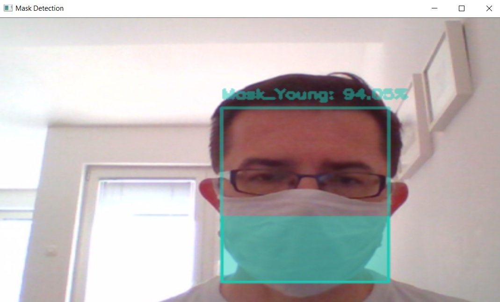
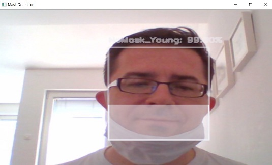

# Face-Mask-classification
### Model that will recognize whether a person wear a mask on his face or not / young or old person 
- The goal of your project is to create a robust classifier, to collect data and prepare custom dataset.  
- You will build a model that will recognize whether a person wear a mask on his face or not.  
- Furthermore, the system needs to recognize whether a person is young or old. 
_______________________________________________________________________________
  
 
## Project was divided in 3 Phases:
### Phase 1 : Dataset
- General Project Research  
_________________________________________________________________________________
- Dataset Collection  
This dataset consists of 2940 images belonging to four classes in four folders:

with_mask young people: 775 images  
with_mask old people: 685 images  
without_mask young people: 756 images  
without_mask old people: 724 images  

The images used were real images of faces wearing masks and faces without masks.
_____________________________________________________________________________________
- Dataset Preparation  

We expand the size of a training dataset by creating modified versions of images in the dataset 
Dataset was divided on train 80% /test 10% /valid 10% folders with python code   
with use split-folder library  
```
import split_folders
split_folders.ratio('data_final', output="output", seed=1337, ratio=(.8, .1, .1))
```

### Phase 2 : Training
- Research about neural networks  

To solve this problem, we propose a method for classification through transfer learning with several Keras models.   
-  MobileNetV2 trained in ImageNet  - 50 epoch Accuracy 91,00 % 
-  Xception model trained in ImageNet   - 100 epoch with Accuracy 95,97% 
   -   Used Data Augmentation and fine tunning with freeze layers
-  DenseNet-169 model trained in ImageNet  - 100 epoch  Accuracy 96,98%  
__________________________________________________________________________________________________
- Compose neural network architectures  
Best results was achieved with DenseNet-169 model trained in ImageNet  - 100 epoch  Accuracy 96,98%    
The experimental results show that transfer learning can achieve very good results in small dataset, and the final accuracy of face mask detection is 96,98%
```
 precision    recall  f1-score   support

           0       0.96      0.94      0.95        71
           1       0.95      0.96      0.95        77
           2       0.97      0.99      0.98        72
           3       0.99      0.99      0.99        77

   micro avg       0.97      0.97      0.97       297
   macro avg       0.97      0.97      0.97       297
weighted avg       0.97      0.97      0.97       297
 samples avg       0.97      0.97      0.97       297
```
___________________________________________________________________________________________________
- Fine tunning the model   
The model was fine tunned with GlobalAveragePooling2D which acts like regularizer.  
___________________________________________________________________________________________________
